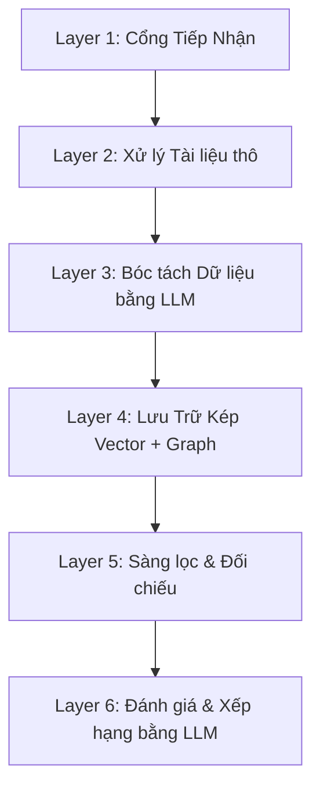

# Hướng dẫn Nhập môn: Kiến trúc Hệ thống AI CV Matcher

Chào mừng bạn gia nhập dự án! Tài liệu này được viết theo hướng đơn giản và trực quan nhất để giúp bạn nhanh chóng hiểu được toàn bộ "cơ ngơi" của hệ thống **AI CV Matcher**. 

Về bản chất, hệ thống của chúng ta là một cỗ máy **Hybrid RAG** (kết hợp giữa tìm kiếm Vector truyền thống và Cơ sở dữ liệu Đồ thị - GraphRAG) nhằm mô phỏng lại 100% tư duy tuyển dụng của một chuyên gia HR thực thụ.

---

## 1. Bức tranh Tổng thể: Kiến trúc 6 Lớp (6-Layer Architecture)

Hãy tưởng tượng hệ thống của chúng ta như một quy trình phỏng vấn chia làm 6 phòng ban:

1. **Layer 1 (Cổng Tiếp Nhận - Input):** Nhận CV của ứng viên (PDF, Word) và Yêu cầu tuyển dụng (JD) từ HR.
2. **Layer 2 (Xử lý Tài liệu - Parsing):** Đóng vai trò như một chiếc máy scan. Đọc chữ từ file. Nếu là file PDF bị scan/chụp ảnh, hệ thống tự động gọi AI chuyên thị giác (Surya/Qwen-VL) để đọc chữ ra.
3. **Layer 3 (Bóc tách - Structuring):** Đưa toàn bộ đoạn văn thô cho LLM đọc và nhặt ra các trường cụ thể (Tên, Năm kinh nghiệm, Kỹ năng, Công ty cũ...) ép vào khuôn mẫu JSON gọn gàng (`Pydantic Schema`).
4. **Layer 4 (Lưu trữ - Indexing):** Dữ liệu JSON sau đó được lưu vào 2 kho chứa khác nhau: 
   - **Kho Vector (Qdrant):** Lưu văn bản dưới dạng "vector đa chiều" để máy tính hiểu được ý nghĩa.
   - **Kho Đồ thị (FalkorDB):** Lưu mạng lưới quan hệ (Ai làm ở đâu? Học trường nào? Kỹ năng nào tương đương kỹ năng nào?).
5. **Layer 5 (Sàng lọc - Matching):** Lọc ứng viên qua nhiều màng lọc (từ lọc mềm bằng Vector cho đến lọc cứng bằng Python).
6. **Layer 6 (Đánh giá - Scoring):** Đưa các hồ sơ đã qua vòng gửi xe cho Giám khảo LLM chấm điểm chi tiết (0-100) để ra bảng xếp hạng cuối cùng.

---

## 2. Câu chuyện Luồng Dữ liệu (The Data Journey)

Để dễ hiểu nhất, hãy cùng đi theo hành trình của dữ liệu qua 3 trường hợp sử dụng thực tế.

### Hành trình 1: Khi một CV được nộp vào hệ thống
1. Ứng viên nộp CV dạng PDF. Hệ thống phân tích văn bản (Layer 2) thành chuỗi chữ thô.
2. Hệ thống yêu cầu LLM (Layer 3) đọc chuỗi chữ đó và trả về: `[Kỹ năng: ReactJS, Python], [Kinh nghiệm: 2 năm tại công ty X]...`
3. Hệ thống tạo **Vector** đại diện cho CV này và cất vào Qdrant.
4. Song song đó, thuật toán **Entity Resolution** được chạy. Hệ thống biết rằng chữ `ReactJS` trong CV này thực chất cũng chính là `React` hay `React.js`, nên nó gộp chung thành một điểm (Node) duy nhất tên là `skill_react` trong **Graph Database**. Nó nối một đường thẳng từ ứng viên đó tới kỹ năng `skill_react`. CV đã sẵn sàng để được tìm kiếm!

### Hành trình 2: Khi HR tạo một Yêu cầu tuyển dụng (JD)
1. HR nhập JD tìm "Lập trình viên Backend, yêu cầu biết DeepSeek V4".
2. LLM bóc tách ra kỹ năng `DeepSeek V4`. 
3. **Tính năng Bẫy từ khóa (Keyword Discovery):** Hệ thống quét trong Đồ thị (GraphDB) và nhận ra: *"Ồ, DeepSeek V4 là một công nghệ hoàn toàn mới, hệ thống chưa từng biết"*.
4. **Tính năng Kết nối Động (JIT Wiring):** Hệ thống ngay lập tức tạo một Node mới cho `DeepSeek V4` trong Đồ thị, sau đó tự động gọi LLM ra lệnh: *"Hãy kết nối công nghệ mới này vào mạng lưới hiện tại đi"*. LLM sẽ tự động nối `DeepSeek V4` có quan hệ họ hàng với các node `AI`, `ChatGPT`, `LLMs`. Bằng cách này, hệ thống **tự động học hỏi công nghệ mới từ thị trường** mà không cần lập trình viên can thiệp.

### Hành trình 3: Khớp lệnh (Matching CV vs JD)
Khi HR bấm nút tìm kiếm ứng viên cho JD trên, một chuỗi bộ lọc sẽ được kích hoạt:

1. **Mở rộng Truy vấn (Query Expansion):** Nhờ Đồ thị, hệ thống biết `DeepSeek V4` có liên quan đến `ChatGPT`. Nó ngầm cộng thêm `ChatGPT` vào lệnh tìm kiếm để không bỏ sót ứng viên giỏi AI nhưng chưa kịp cập nhật CV.
2. **Quét Vector (Hybrid Retrieval):** Hệ thống dùng Qdrant bới trong hàng ngàn CV để lôi ra Top 20 người có CV mang ý nghĩa (Vector) giống với JD nhất.
3. **Duyệt điều kiện Cứng (Hard-Match):** 20 người này bị đưa qua bộ lọc Python khắt khe: 
   - Đủ số năm kinh nghiệm thực tế ở doanh nghiệp chưa? (Lọc bỏ các dự án sinh viên/freelancer bằng GraphDB).
   - Có đáp ứng tối thiểu 50% số kỹ năng bắt buộc chưa?
4. **Chấm điểm (Scoring):** Những người sống sót qua vòng Hard-Match sẽ được LLM đánh giá định tính từng kỹ năng một. Người nào có bằng cấp/chứng chỉ (chứng minh qua GraphDB) sẽ được LLM cộng điểm thưởng. Cuối cùng, nhân với tỷ trọng (Weights) của HR để ra điểm chung cuộc `% Fit`.

---

## 3. Tại sao Vector Database thôi là chưa đủ? (Vai trò của GraphDB)

Nhiều hệ thống hiện nay chỉ dùng Vector Database (như Qdrant/Chroma). Vector rất giỏi tìm kiếm theo ý nghĩa (Semantic search), nhưng lại cực kỳ ngốc trong các bài toán **logic ràng buộc khắt khe của HR**. Đó là lý do chúng ta tích hợp thêm **FalkorDB (Graph Database)** làm não bộ suy luận.

**3 ví dụ Đồ thị giải cứu Vector:**
1. **Tránh bẫy kinh nghiệm ảo:** Một bạn sinh viên ghi *"Làm dự án web cá nhân 3 năm"*. Vector sẽ đếm bạn này có 3 năm kinh nghiệm. Nhưng Đồ thị phân biệt được mối quan hệ là `[BUILT] ➔ Project` (Dự án) chứ không phải `[WORKED_AT] ➔ Company` (Công ty). Hệ thống sẽ trừ sạch 3 năm này đi nếu JD yêu cầu "kinh nghiệm thực chiến doanh nghiệp".
2. **Khử trùng lặp kỹ năng:** `Vue.js`, `VueJS` và `Vue` đối với Vector là 3 cụm từ khác nhau (khoảng cách vector bị lệch nhẹ). Đồ thị chuẩn hóa chúng thành một Node duy nhất. 
3. **Tri thức thay thế:** JD tìm người biết `AWS`. Hệ thống biết `GCP` là một Node đối thủ (Mối quan hệ `[ALTERNATIVE_TO]`) với độ tương đồng `0.8`. Hệ thống vẫn sẽ tiến cử ứng viên GCP cho HR thay vì loại bỏ họ một cách máy móc. (Độ tương đồng này được LLM chấm điểm theo **Scoring Rubric** cực kỳ tinh tế từ `0.0` đến `1.0`).

> [!NOTE]
> **Tóm lại:** Nhờ kết hợp (Hybrid) giữa VectorDB (tìm kiếm ngữ nghĩa nhanh) và GraphDB (khung logic kiến thức), hệ thống AI CV Matcher của chúng ta vừa có sự mượt mà của AI, vừa giữ được sự chính xác tuyệt đối như một máy tính!
