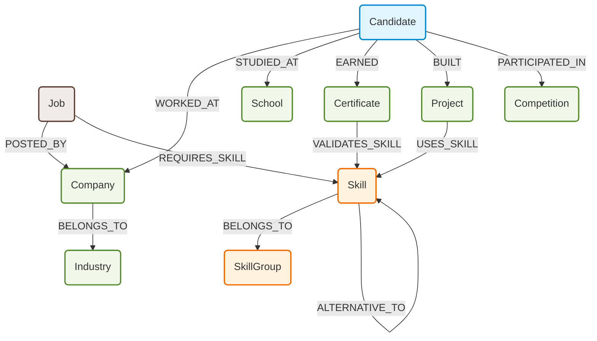
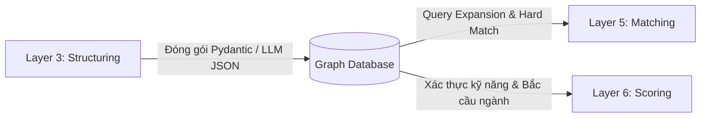

# Chiến Lược Triển Khai Graph Database (Graph DB Strategy)

Tài liệu này mô tả chi tiết chiến lược triển khai cơ sở dữ liệu đồ thị (Graph Database - ví dụ: Neo4j) trong hệ thống AI CV Matcher. Graph DB đóng vai trò là Layer hỗ trợ đắc lực cho các thuật toán **Hard-match (Layer 5)**, **Query Expansion (Layer 5)**, và cung cấp tri thức bắc cầu để nâng cao độ chính xác của **LLM Scorer (Layer 6)**.

---

## 1. Sơ Đồ Tổng Quan Thực Thể & Mối Quan Hệ (Graph Schema)

Dưới đây là mô hình đồ thị kết nối thông tin của Ứng viên (Candidate) và Tin tuyển dụng (Job):



---

## 2. Chi Tiết Các Thực Thể (Nodes)

| Tên Thực Thể | Thuộc Tính | Ý Nghĩa / Mục Tiêu Hệ Thống | Ví Dụ Cypher Query |
| :--- | :--- | :--- | :--- |
| **Candidate**<br>*(Ứng viên)* | <ul><li>`id`: string (UUID)</li><li>`name`: string</li><li>`phone`: string</li><li>`email`: string</li><li>`summary`: string</li><li>`soft_skill`: string</li><li>`volunteering`: string</li></ul> | Khởi tạo phiên đánh giá hồ sơ. Bóc tách các trường dữ liệu phi cấu trúc làm ngữ cảnh cho LLM. | `MATCH (c:Candidate {id: "cand_tien"})`<br>`RETURN c.name, c.summary` |
| **Job**<br>*(Tin tuyển dụng)* | <ul><li>`id`: string (UUID)</li><li>`position`: string</li><li>`min_exp_years`: float</li><li>`level`: string</li><li>`domain`: string</li><li>`location`: string</li></ul> | Lưu trữ thông tin chi tiết về tin tuyển dụng đang xét. | `MATCH (j:Job {id: "job_senior_backend"})`<br>`RETURN j.position, j.min_exp_years` |
| **Company**<br>*(Doanh nghiệp)* | <ul><li>`name`: string (Chuẩn hóa)</li></ul> | Giải quyết bài toán liên kết doanh nghiệp (kiểm tra đối tác, công ty cũ, đối thủ...). | `MATCH (comp:Company {name: "Fintech Corp"})`<br>`RETURN comp` |
| **Industry**<br>*(Ngành nghề)* | <ul><li>`name`: string (Ví dụ: "IT", "Fintech"...)</li></ul> | Đánh giá độ phù hợp chuyên môn bắc cầu (ứng viên làm công ty khác nhưng chung ngành tuyển dụng). | `MATCH (i:Industry {name: "Fintech"})`<br>`RETURN i` |
| **Skill**<br>*(Kỹ năng chuyên môn)* | <ul><li>`name`: string (Chuẩn hóa)</li></ul> | Giải quyết Entity Resolution (chuẩn hóa các từ viết khác nhau: React, ReactJS, React.js về 1 node). | `MATCH (s:Skill)`<br>`WHERE s.name IN ["Python", "FastAPI"]`<br>`RETURN s` |
| **SkillGroup**<br>*(Nhóm công nghệ)* | <ul><li>`name`: string (Ví dụ: "Cloud Computing", "Web Framework")</li></ul> | Suy luận năng lực diện rộng. Nếu ứng viên có nhiều Skill thuộc cùng 1 Group, hệ thống tự suy luận ứng viên có thế mạnh mảng đó. | `MATCH (sg:SkillGroup {name: "Cloud"})`<br>`RETURN sg` |
| **School**<br>*(Trường học)* | <ul><li>`name`: string (Chuẩn hóa)</li></ul> | Phục vụ bộ lọc mạng lưới trường mục tiêu (target schools) và thuật toán heuristic re-ranking. | `MATCH (sch:School {name: "Đại học Bách Khoa"})`<br>`RETURN sch` |
| **Project**<br>*(Dự án/Đồ án)* | <ul><li>`name`: string</li><li>`description`: string</li></ul> | Bù điểm kinh nghiệm/Tech Stack cho Fresher/Intern thông qua các dự án cá nhân hoặc đồ án. | `MATCH (p:Project)`<br>`WHERE p.name CONTAINS "SmartTrace"`<br>`RETURN p.description` |
| **Certificate**<br>*(Chứng chỉ)* | <ul><li>`name`: string (Chuẩn hóa)</li></ul> | Làm bằng chứng uy tín cho kỹ năng. Phục vụ heuristic re-ranking để cộng điểm thưởng (English/Tech Cert Boost). | `MATCH (cert:Certificate {name: "AWS Developer"})`<br>`RETURN cert` |
| **Competition**<br>*(Cuộc thi)* | <ul><li>`name`: string</li></ul> | Phát hiện các ứng viên sinh viên xuất sắc, năng động và có năng lực thực chiến cao qua cuộc thi công nghệ. | `MATCH (comp:Competition)`<br>`WHERE comp.name CONTAINS "Hackathon"`<br>`RETURN comp` |

---

## 3. Chi Tiết Các Mối Quan Hệ (Relationships / Edges)

### 3.1. `[:WORKED_AT]` (Candidate ➔ Company)
*   **Thuộc tính:**
    *   `position`: string (Vị trí công việc cũ)
    *   `duration_months`: int (Thời gian làm việc tính bằng tháng)
    *   `experience_type`: string (Loại hình: `Corporate`, `Internship`, `Freelance`...)
*   **Trường hợp sử dụng:** Tính toán thâm niên làm việc thực tế ở doanh nghiệp. Dùng Python logic để quét thuộc tính này và cộng dồn, tự động loại trừ các kinh nghiệm không chính thức (freelancer, đồ án) để lọc cứng điều kiện số năm kinh nghiệm.
*   **Ví dụ Cypher:**
    ```cypher
    MATCH (c:Candidate)-[r:WORKED_AT]->(comp:Company)
    WHERE r.experience_type = "Corporate"
    RETURN sum(r.duration_months) AS total_corporate_months
    ```

### 3.2. `[:POSTED_BY]` (Job ➔ Company)
*   **Trường hợp sử dụng:** Xác định công ty đăng tuyển dụng nhằm tạo điểm gốc (Root Node) phục vụ cho thuật toán tìm đường đi ngắn nhất để liên kết với các công ty cũ của ứng viên.
*   **Ví dụ Cypher:**
    ```cypher
    MATCH (j:Job {id: "job_01"})-[:POSTED_BY]->(comp:Company)
    RETURN comp.name
    ```

### 3.3. `[:BELONGS_TO]` (Company ➔ Industry)
*   **Trường hợp sử dụng:** Tìm liên kết ngành bắc cầu. Giúp nhận diện và cộng điểm ưu tiên khi ứng viên từng làm tại công ty thuộc cùng ngành nghề với đơn vị tuyển dụng (ví dụ: Fintech).
*   **Ví dụ Cypher:**
    ```cypher
    MATCH (comp:Company)-[:BELONGS_TO]->(ind:Industry)
    RETURN ind.name
    ```

### 3.4. `[:BELONGS_TO]` (Skill ➔ SkillGroup)
*   **Trường hợp sử dụng:** Suy luận phân cấp kỹ năng. Khi JD yêu cầu kỹ năng thuộc nhóm diện rộng (ví dụ: Web Framework), đồ thị sẽ giúp truy ngược xuống các công nghệ con (FastAPI, Django, Flask) để không bỏ sót ứng viên.
*   **Ví dụ Cypher:**
    ```cypher
    MATCH (s:Skill {name: "FastAPI"})-[:BELONGS_TO]->(sg:SkillGroup)
    RETURN sg.name
    ```

### 3.5. `[:ALTERNATIVE_TO]` (Skill ➔ Skill)
*   **Thuộc tính:**
    *   `similarity`: float (Độ tương đồng công nghệ, từ 0.0 đến 1.0)
*   **Trường hợp sử dụng:** Hỗ trợ **Query Expansion (Layer 5)**. Khi nhận JD yêu cầu "AWS" với similarity >= 0.8, hệ thống sẽ mở rộng truy vấn thêm "Google Cloud", "Azure" trước khi chạy tìm kiếm.
*   **Ví dụ Cypher:**
    ```cypher
    MATCH (s:Skill {name: "AWS"})-[r:ALTERNATIVE_TO]->(alt:Skill)
    WHERE r.similarity >= 0.8
    RETURN alt.name
    ```

### 3.6. `[:STUDIED_AT]` (Candidate ➔ School)
*   **Thuộc tính:**
    *   `major`: string (Ngành học)
    *   `gpa`: float (Điểm trung bình tích lũy)
    *   `grad_year`: int (Năm tốt nghiệp)
    *   `degree`: string (Bằng cấp: `Bachelor`, `Master`, `PhD`...)
*   **Trường hợp sử dụng:** Kiểm duyệt học vị tối thiểu hoặc trường mục tiêu ở khâu lọc cứng (Layer 5).
*   **Ví dụ Cypher:**
    ```cypher
    MATCH (c:Candidate)-[r:STUDIED_AT]->(sch:School)
    WHERE r.degree IN ["Bachelor", "Master"] AND r.gpa >= 8.5
    RETURN c.name
    ```

### 3.7. `[:EARNED]` (Candidate ➔ Certificate)
*   **Trường hợp sử dụng:** Liên kết ứng viên với các chứng chỉ đạt được để kiểm tra tính hợp lệ của hồ sơ.
*   **Ví dụ Cypher:**
    ```cypher
    MATCH (c:Candidate)-[:EARNED]->(cert:Certificate)
    RETURN cert.name
    ```

### 3.8. `[:VALIDATES_SKILL]` (Certificate ➔ Skill)
*   **Trường hợp sử dụng:** Xác thực kỹ năng. Nếu có đường đi `Candidate ➔ Certificate ➔ Skill`, hệ thống sẽ gán trọng số tin cậy tối đa cho kỹ năng đó thay vì chỉ dựa vào tự khai báo.
*   **Ví dụ Cypher:**
    ```cypher
    MATCH (cert:Certificate)-[:VALIDATES_SKILL]->(s:Skill)
    RETURN s.name
    ```

### 3.9. `[:BUILT]` (Candidate ➔ Project)
*   **Thuộc tính:**
    *   `project_type`: string (`Personal` - cá nhân, `Academic` - đồ án đại học)
*   **Trường hợp sử dụng:** Xác định nguồn gốc và tính chất của dự án để đưa vào thuật toán chấm điểm phù hợp.
*   **Ví dụ Cypher:**
    ```cypher
    MATCH (c:Candidate)-[r:BUILT]->(p:Project)
    RETURN p.name, r.project_type
    ```

### 3.10. `[:USES_SKILL]` (Project ➔ Skill)
*   **Trường hợp sử dụng:** Minh chứng năng lực thực hành kỹ năng chuyên môn thông qua dự án cụ thể.
*   **Ví dụ Cypher:**
    ```cypher
    MATCH (p:Project)-[:USES_SKILL]->(s:Skill)
    RETURN s.name
    ```

### 3.11. `[:PARTICIPATED_IN]` (Candidate ➔ Competition)
*   **Thuộc tính:**
    *   `rank`: string (Giải thưởng: `Winner`, `Runner-up`, `Top 10`...)
*   **Trường hợp sử dụng:** Kích hoạt các bộ cộng điểm thưởng heuristic vào kinh nghiệm hoặc kỹ năng của ứng viên nếu đạt giải cao.
*   **Ví dụ Cypher:**
    ```cypher
    MATCH (c:Candidate)-[r:PARTICIPATED_IN]->(comp:Competition)
    RETURN comp.name, r.rank
    ```

### 3.12. `[:REQUIRES_SKILL]` (Job ➔ Skill)
*   **Thuộc tính:**
    *   `is_mandatory`: boolean (Kỹ năng bắt buộc phải có hay không)
*   **Trường hợp sử dụng:** Thực thi bộ lọc kỹ năng cứng bắt buộc tại **Layer 5**. Hệ thống lấy ra các skill có `is_mandatory: true` từ Job, đối chiếu trực tiếp với sub-graph kỹ năng của ứng viên để xem có đáp ứng tối thiểu (ví dụ: 50%) lượng kỹ năng bắt buộc hay không.
*   **Ví dụ Cypher:**
    ```cypher
    MATCH (j:Job {id: "job_01"})-[r:REQUIRES_SKILL]->(s:Skill)
    RETURN s.name, r.is_mandatory
    ```

---

## 4. Vai Trò Của Graph DB Trong Quy Trình 6 Layer

> [!NOTE]
> Graph DB không thay thế Vector Database (Qdrant) mà đóng vai trò hỗ trợ giải quyết các logic ngữ cảnh phức tạp.



1.  **Layer 3 (Structuring):** LLM phân tích văn bản CV/JD thô thành JSON cấu trúc dựa trên **Pydantic schema** (ví dụ: `CVSchema`, `JDSchema`). Thông tin này sau đó được ánh xạ trực tiếp thành các Nodes & Edges để đưa vào Graph DB.
2.  **Layer 5 (Matching):**
    *   **Hard-match filters:** Sử dụng các truy vấn đồ thị để kiểm tra điều kiện học vị (`degree`), số năm kinh nghiệm thực tế ở doanh nghiệp (loại trừ freelance/project qua `WORKED_AT`), và danh sách trường mục tiêu.
    *   **Query Expansion:** Mở rộng từ khóa kỹ năng qua liên kết `ALTERNATIVE_TO` để tăng diện phủ khi tìm kiếm Vector/BM25.
    *   **Mandatory Skills Match:** Lọc ứng viên không đạt tối thiểu tỷ lệ kỹ năng bắt buộc (`REQUIRES_SKILL` với `is_mandatory: true`).
3.  **Layer 6 (Scoring):** Cung cấp các tri thức bổ trợ (như chứng chỉ bảo chứng cho skill, làm việc tại công ty đối tác hoặc cùng ngành) để làm input cho LLM Scorer hoặc thuật toán Heuristic Weighting tính điểm Match Score cuối cùng.
