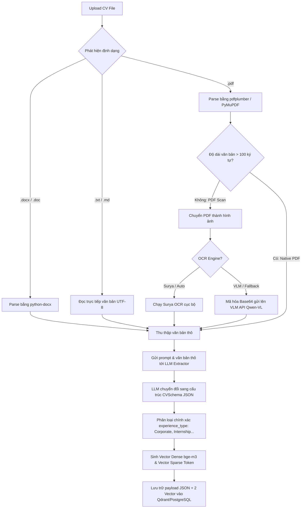
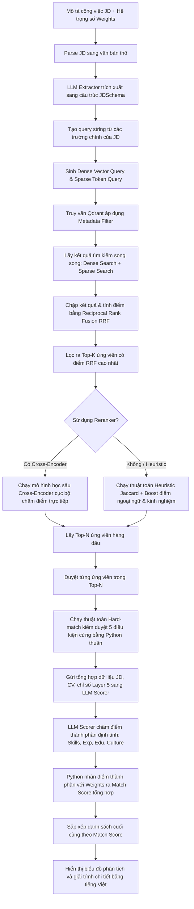

# Tổng quan Luồng hoạt động Hệ thống (System Workflow)

Tài liệu này mô tả chi tiết luồng dữ liệu (Dataflow) và quy trình hoạt động (Workflow) của hệ thống AI CV Matcher từ thời điểm người dùng tải file lên cho đến khi nhận được bảng xếp hạng ứng viên chi tiết.

---

## 1. Tổng quan Luồng Kiến trúc 6 Layer

Hệ thống hoạt động theo mô hình 6 lớp phân tách rõ ràng nhiệm vụ:

```
                  ┌──────────────────────────────┐
                  │      Layer 1: Input          │  <-- CV PDF/Word, JD, Weights Config
                  └──────────────┬───────────────┘
                                 ▼
                  ┌──────────────────────────────┐
                  │   Layer 2: Parsing & OCR     │  <-- pdfplumber, docx, Surya/VLM
                  └──────────────┬───────────────┘
                                 ▼
                  ┌──────────────────────────────┐
                  │    Layer 3: Structuring      │  <-- LLM Extractor (FastAPI / Schema)
                  └──────────────┬───────────────┘
                                 ▼
                  ┌──────────────────────────────┐
                  │ Layer 4: Indexing (Vector)   │  <-- Qdrant + PostgreSQL Metadata
                  └──────────────┬───────────────┘
                                 ▼
                  ┌──────────────────────────────┐
                  │     Layer 5: Matching        │  <-- Python Hard-match + Hybrid RRF + Rerank
                  └──────────────┬───────────────┘
                                 ▼
                  ┌──────────────────────────────┐
                  │      Layer 6: Scoring        │  <-- LLM Scorer + Weighted Math Calculation
                  └──────────────────────────────┘
```

---

## 2. Quy trình A: Nạp và Chỉ mục hóa CV (CV Ingestion & Indexing)

Quy trình này xảy ra khi người dùng tải CV của ứng viên lên hệ thống thông qua giao diện hoặc gọi lệnh nạp dữ liệu:



### Chi tiết các bước:
1. **Routing File (Layer 2):** Xác định định dạng để sử dụng thư viện thích hợp. Đối với PDF, nếu không có lớp chữ (Text Layer) hoặc lớp chữ quá ngắn (< 100 ký tự), hệ thống tự động nhận dạng là file scan và kích hoạt OCR.
2. **Structuring (Layer 3):** Sử dụng prompt hướng dẫn LLM phân tích văn bản thô để trích xuất các thông tin cá nhân, kỹ năng, chứng chỉ và lịch sử làm việc. Đặc biệt, LLM phải gán nhãn chính xác loại hình công việc (`experience_type`) cho từng công việc để loại bỏ dự án cá nhân/học tập khỏi số năm kinh nghiệm thực tế sau này.
3. **Indexing (Layer 4):**
   - Sinh vector dày đặc đại diện ngữ nghĩa (Dense Vector).
   - Sinh vector thưa thớt đại diện từ khóa tần suất (Sparse Vector).
   - Lưu trữ song song vào Qdrant. Dữ liệu văn bản thô và JSON được đóng gói vào payload của điểm dữ liệu trong vector database.

---

## 3. Quy trình B: So khớp, Đánh giá và Xếp hạng (Match & Rank Query)

Quy trình này được kích hoạt khi nhà tuyển dụng cung cấp một JD (tập tin hoặc văn bản nhập tay) cùng hệ trọng số chấm điểm và nhấn nút **Evaluate Candidates**:



### Chi tiết các bước:
1. **Structuring JD (Layer 3):** Tương tự như CV, văn bản JD được phân tích bởi LLM để trích xuất các điều kiện cứng và kỹ năng yêu cầu cụ thể (lưu dưới cấu trúc `JDSchema`).
2. **Hybrid Search (Layer 5 - Phase 1):** Gửi chuỗi truy vấn JD lên Qdrant để chạy đồng thời Dense Search (tìm kiếm theo ý nghĩa tương đồng) và Sparse Search (tìm kiếm khớp chính xác các từ khóa công nghệ). Giải thuật RRF hợp nhất hai kết quả này để đảm bảo ứng viên tốt nhất xuất hiện ở đầu danh sách.
3. **Re-ranking (Layer 5 - Phase 2):** Sử dụng mô hình Cross-Encoder chuyên dụng hoặc thuật toán Heuristic (kết hợp Jaccard từ khóa + điểm thưởng cho hồ sơ có chứng chỉ tiếng Anh + điểm thưởng cho hồ sơ có thâm niên làm việc tại doanh nghiệp thực tế) để sắp xếp lại danh sách Top-K thành danh sách Top-N chọn lọc hơn.
4. **Hard-Matching (Layer 5 - Phase 3):** Thuật toán Python chạy trực tiếp để kiểm duyệt 5 chỉ số bắt buộc:
   - Tổng số năm kinh nghiệm liên quan có đáp ứng mức tối thiểu.
   - Ứng viên có tối thiểu 50% kỹ năng bắt buộc trong JD.
   - Trình độ học vị cao nhất đáp ứng yêu cầu tuyển dụng.
   - Có chứng chỉ tiếng Anh quốc tế (IELTS/TOEIC).
   - Đã từng làm việc tại doanh nghiệp thực tế (không duyệt hồ sơ chỉ làm dự án cá nhân).
5. **LLM Scorer & Final Math (Layer 6):** 
   - LLM đọc toàn bộ thông tin chi tiết của ứng viên, đối chiếu với JD và kết quả đo đạc từ Layer 5 để chấm điểm thành phần (từ 0-100) cho: Skills, Experience, Education, và Culture Fit.
   - LLM bắt buộc phải phạt điểm kinh nghiệm dưới 50 nếu hồ sơ chỉ có đồ án học tập/dự án cá nhân, cộng điểm thưởng nếu ứng viên có chứng chỉ tiếng Anh.
   - Python lấy điểm từ LLM nhân với hệ trọng số HR thiết lập ban đầu để tính điểm tổng hợp (`match_score`).
6. **Báo cáo kết quả:** Gửi bảng xếp hạng ứng viên kèm biểu đồ trực quan và phần giải trình bằng tiếng Việt về Frontend.
